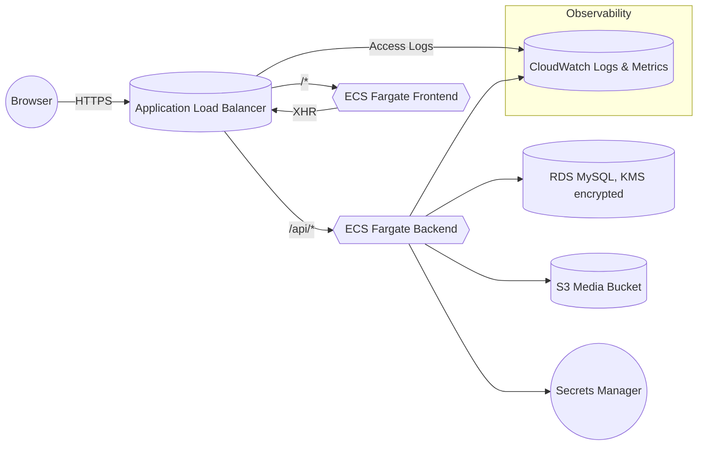

# Expense Settlement Platform

Full-stack application featuring a FastAPI backend, a Vite + React frontend, and Terraform-managed AWS infrastructure (ECS Fargate, ALB, RDS, S3, CloudWatch, Secrets Manager).

## Architecture overview



- **Frontend**: Vite + React SPA with Bootstrap styling.
- **Backend**: FastAPI service that can run in file-storage mode for dev or switch to MySQL + S3 in prod.
- **Infrastructure**: Terraform provisions VPC, ECS Fargate services, ALB + Route53 + ACM, RDS (Multi-AZ, CMK-encrypted), S3 media bucket, Secrets Manager, and CloudWatch observability (Container Insights + optional agent sidecars).

## Repository layout

```
backend/   FastAPI project (see backend/README.md)
frontend/  React SPA (see frontend/README.md)
infra/     Terraform IaC (see infra/README.md)
```

Each directory has its own `README.md` with environment variables, commands, and deployment/test instructions.

## Local development summary

- **Backend**: `python3 -m venv .venv && source .venv/bin/activate && pip install -r requirements.txt && uvicorn app.main:app --reload`
- **Frontend**: `npm install && npm run dev`
- **Infra**: `terraform init && terraform plan` (after the remote state bucket/DynamoDB lock table exist and AWS credentials are exported)

See the folder-specific READMEs for full details (MySQL schema, S3 uploads, etc.).

## Automated tests

| Layer     | Command                                      | Notes |
|-----------|----------------------------------------------|-------|
| Backend   | `cd backend && python3 -m pytest`            | Runs pure unit tests and FastAPI integration tests. |
| Frontend  | `cd frontend && npm test -- --run`           | Executes Vitest + Testing Library specs (warnings about React Router “future flags” are benign). |
| Terraform | `cd infra && TF_CLI_ARGS_init=-backend=false terraform test` | Plans the root module with fixture variables. AWS credentials must still be available because of the AWS provider. |

The latest run (from this session) shows both backend and frontend suites passing. Terraform tests require valid AWS creds; otherwise Terraform’s AWS provider will abort before planning.

## Infrastructure state & deployment

- Bootstrap remote state with `infra/state-bootstrap` (creates an S3 bucket + DynamoDB lock table).
- `infra/versions.tf` points Terraform at that backend. Override with your own bucket/region/table names.
- Provision AWS credentials (either environment variables or an AWS profile).
- Deploy with `terraform init`, `terraform plan`, and `terraform apply` in `infra/`.
- CloudWatch logs are created automatically; ECS Container Insights and CloudWatch Agent sidecars handle metrics.

## Documentation & next steps

- [docs/API.md](docs/API.md) – REST endpoint reference.
- [docs/LOCAL_DEV.md](docs/LOCAL_DEV.md) – Configuration matrices for dev/QA environments.
- [docs/SECURITY.md](docs/SECURITY.md) – Security posture & recommendations.
- [backend/README.md](backend/README.md) – FastAPI setup, prod vs. dev modes, pytest instructions.
- [frontend/README.md](frontend/README.md) – Vite dev server, env vars, Vitest usage.
- [infra/README.md](infra/README.md) – Terraform commands, remote state bootstrap, CloudWatch/observability, testing notes.

Refer to `Database` or `backend/db/schema.sql` for MySQL DDL, and `requirements.log` for the running list of shipped capabilities.
